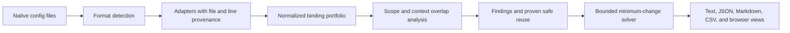

# Architecture

Keybind Doctor uses one browser-safe TypeScript core for the CLI and React
workbench.

## Normalized binding

Every adapter emits the same shape:

- source format and application;
- command identifier;
- normalized key sequence with ordered strokes;
- `global`, `application`, or `context` scope;
- optional context expression;
- enabled and locked policy flags;
- input filename and line number.

Modifier aliases are normalized to `ctrl`, `alt`, `shift`, and `meta`. Chords
retain stroke order. PowerToys virtual-key codes and AutoHotkey modifier symbols
are decoded before analysis.

## Context overlap

The bounded context engine parses:

- boolean atoms and negation;
- `&&` and `||`;
- parentheses;
- `==` and `!=` constraints.

It converts supported expressions to disjunctive normal form. Each clause is a
map of equality and inequality constraints. A pair is disjoint only when every
cross-product of clauses contains a contradiction.

Three-valued output prevents false certainty:

- `overlap`: at least one combined clause is satisfiable;
- `disjoint`: every combined clause is contradictory;
- `unknown`: syntax such as regex or function calls exceeds the bounded model.

Unknown is reported as a potential conflict. It is never treated as safe.

## Pair analysis

Analysis order is deterministic:

1. Remove disabled rules.
2. Normalize and sort bindings.
3. Check platform reservations.
4. Compare exact sequences and chord prefixes.
5. Rule out different application scopes.
6. Prove context disjointness where possible.
7. Classify definite, shadow, potential, or safe reuse.

Process aliases such as `code.exe` and `Visual Studio Code` share one canonical
application identity.

## Repair solver

For each unresolved conflict, the solver:

1. rejects locked bindings;
2. prefers context scope, then application scope, then global scope;
3. prefers one change that resolves more related findings;
4. generates modifier additions, removals, substitutions, and bounded key
   alternatives;
5. mutates earlier strokes when a chord prefix cannot be repaired at the final
   stroke;
6. rejects reserved keys;
7. tests the candidate against every effective binding and earlier suggestion;
8. chooses the lowest cost, then canonical lexical order.

The solver does not optimize an unbounded global assignment problem. Its goal
is a reproducible, explainable plan with conservative collision checks.

## Determinism

- IDs use stable FNV-1a hashes of normalized provenance.
- Findings, safe reuses, suggestions, and warnings are sorted.
- `--deterministic` fixes the report timestamp.
- Web ZIP entries are sorted and receive a fixed year-2000 timestamp.
- `npm pack` output and web ZIP hashes are compared across separated runs by
  the release gate.

## Trust boundaries

The core has no network dependency. Node-only file access lives in the CLI.
Browser file content enters through the File API and remains in memory.
Download code creates a local Blob. No automatic source rewrite exists in
either entry point.
